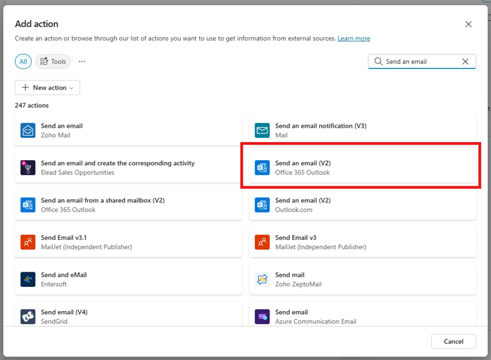
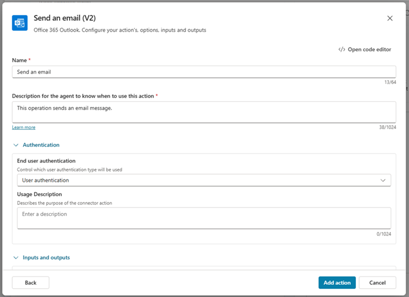
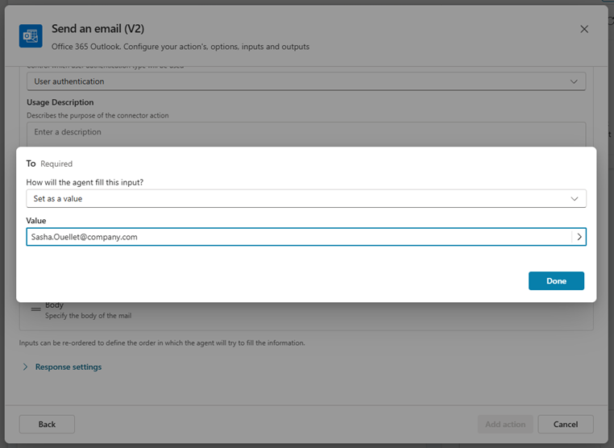
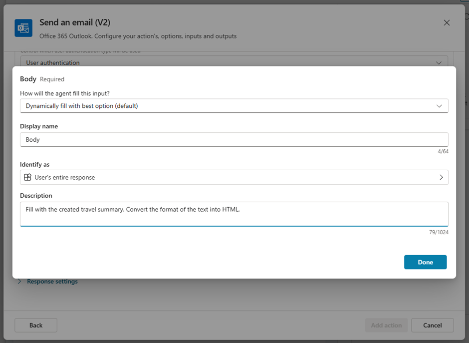

# Use actions with custom agents (preview)

You can extend the capabilities of your agent by adding one or more actions. Actions are used by your agent to respond to users.

## Mechanisms for adding actions

There are different mechanisms available to you to add actions to your agent:

- Prebuilt connector and custom connector: Connect to a service or system and enable specific actions.
- Flow: Define a flow, including triggers as needed, and one or more actions to be carried out by the flow.
- AI Builder prompts (within a topic)
- Bot Framework skill: Container for a set of related actions.
- REST API connection: Define a connection to a REST API, and select one or more API endpoints and methods to add as actions.
- Model Context Protocol action: Connect to an MCP server to access tools.

When you define an action in Copilot Studio, you also provide information that describes its purpose. This information allows the agent to identify when to use the action and also use generative AI to generate questions. These questions are used to gather information to fill the inputs needed to perform the action. As a result, you don't need to manually author question nodes to gather all inputs needed, such as inputs in a flow. Input collection is handled for you at runtime.
By default, actions return their information back to the agent, so that the agent can generate a contextual response to the user's query. Alternatively, you can instruct your action to always respond immediately, either generating a message or authoring an explicit message.

## Add an action

1. Open your agent by choosing **Agents** in the left hand navigation pane and selecting your agent from the list.
2. Scroll down to **Actions** to view actions for the agent.
3. Select **Add action**
4. In the **Choose an action** wizard, search for an action you want to use and select it.  
\
The default list shown has Power Automate Flows and custom connectors available within your environment. This list includes commonly used prebuilt connectors and Bot Framework Skills that are registered with your agent.
\
\

5. In this tutorial, we’re using the “Send an email” action from Office 365 Outlook. Search for it in the search box on the right hand side:
\
\

6. Depending on the action, your connection is automatically configured, as it is in this example. Otherwise, follow the wizard's instructions to configure the connection. Once your connection is successfully configured, select **Next**.
7. In the overview, the description of the action is used by the agent to know when to use this action. For our example, the default value of “This operation sends an email message.” works perfectly fine.
\
\

8. In the lower part of the action, you can configure what information is given to the action when executed (Inputs), and what information shall be given back to the agent after the execution (Outputs). For our example, we can leave the Outputs as they are, but need to adapt all the Inputs.

> [!Important]
> The value of action inputs can be set in two different ways:
>
> 1. **Set as value**: The value that is utilized by the action is set to a fixed value, which is static throughout all utilizations of that action and never changed.
> 2. **Dynamically fill with best option (default)**: This is the default option. Here, the value utilized by the action is dynamically / genereatively filled by the agent itself. This means this value can contain information generated from the agent, provided by the user etc. Therefore, also the expected information type can be changed in the **Identify as** field, e.g. so that it always will convert information into a date, email, boolean etc.
>

1. For the Input “To”, click on Edit and change the filling mode (“How will the agent till this input?”) to “Set as value”, and enter the travel agents email address:
\
\

1.  Similarly, change the Subject to “Set as value”, and enter a subject like “Travel Approval Request”.
2.  For the body, set it to “Dynamically fill with best option (default)” and change the description to “Fill with the created travel summary. Convert the format of the text into HTML.”
\
\

1.  When having this completed, click on **Add action** to save and enable this action for your agent.
