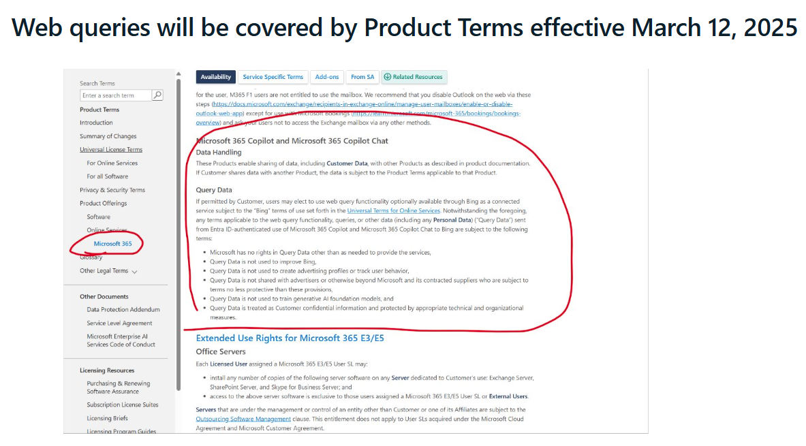

# Bing Search in M365 Copilot

The blog entry communicating the change to how bing search is handled in M365 Copilot: [https://techcommunity.microsoft.com/blog/microsoft365copilotblog/introducing-greater-transparency-and-control-for-web-search-queries-in-microsoft/4253080](Blog)

The M365 Product Terms including this change: [https://www.microsoft.com/licensing/terms/productoffering/Microsoft365/EAEAS#Availability](Product Terms)

Scroll down to "Query Data", see screenshot below:

