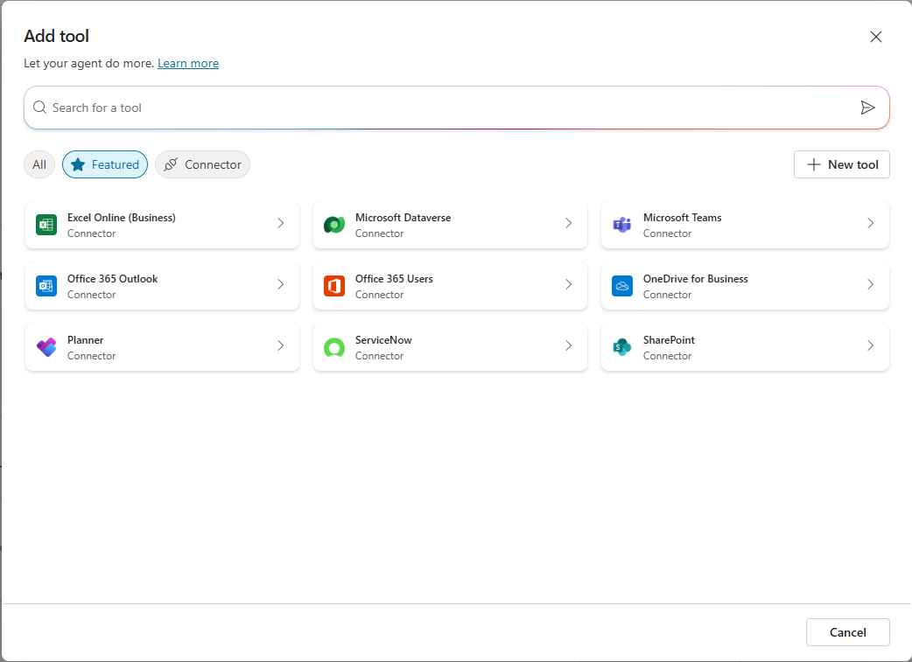
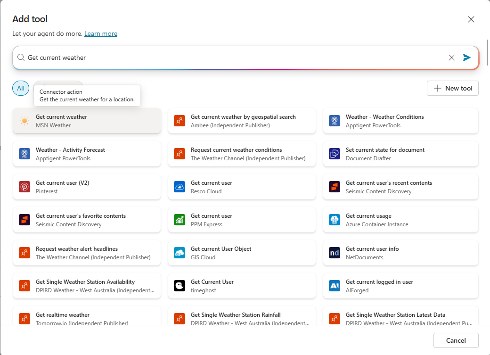
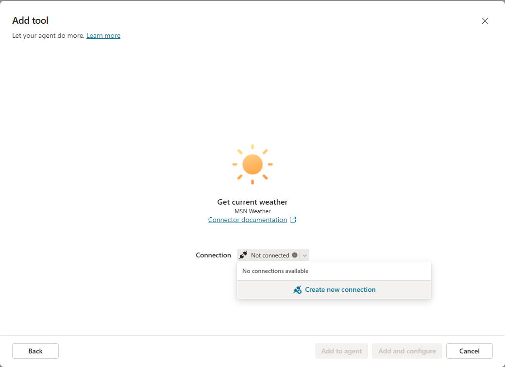
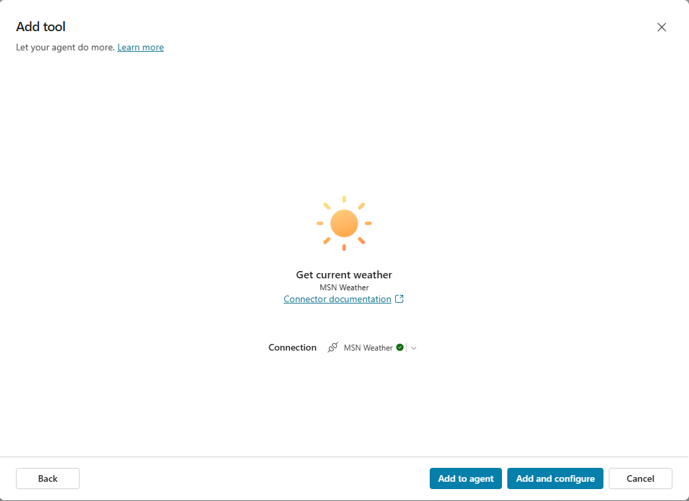
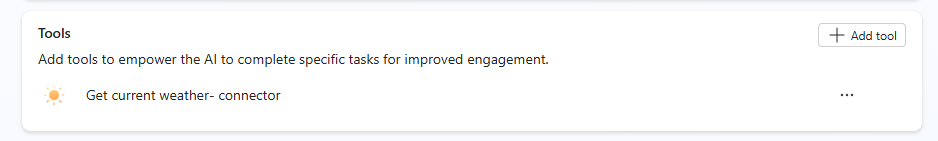

# Use tools (formerly called actions) with custom agents (preview)

You can extend the capabilities of your agent by adding one or more tools, formerly known as actions. Tools are used by your agent to respond to users.

## Mechanisms for adding tools

There are different mechanisms available to you to add tools to your agent:

- Prebuilt connector and custom connector: Connect to a service or system and enable specific tools.
- Flow: Define a flow, including triggers as needed, and one or more tools to be carried out by the flow.
- AI Builder prompts (within a topic)
- Bot Framework skill: Container for a set of related tools.
- REST API connection: Define a connection to a REST API, and select one or more API endpoints and methods to add as tools.
- Model Context Protocol action: Connect to an MCP server to access tools.

When you define a tool in Copilot Studio, you also provide information that describes its purpose. This information allows the agent to identify when to use the tool and also use generative AI to generate questions. These questions are used to gather information to fill the inputs needed to perform the action of the tool. As a result, you don't need to manually author question nodes to gather all inputs needed, such as inputs in a flow. Input collection is handled for you at runtime.
By default, tools return their information back to the agent, so that the agent can generate a contextual response to the user's query. Alternatively, you can instruct your tool to always respond immediately, either generating a message or authoring an explicit message.

## Add an action/tool

1. Go into declarative Agents by choosing **Agents** in the left hand navigation pane and select **Copilot for Microsoft 365**
2. Open your agent from the list or create a new one by clicking **+Add** (If you create a new one, you have to enter the first draft of you instructions and descriptions and click on **Create** once to be able to add actions.)
3. Scroll down to **Tools** to view actions for the agent.
4. Select **Add tool**
5. In the **Search for a tool** wizard, search for an action you want to use and select it.  
\
The default list shown has Power Automate Flows and custom connectors available within your environment. This list includes commonly used prebuilt connectors and Bot Framework Skills that are registered with your agent.
\
\

6. In this tutorial, we’re using the “Get current weather” tool from MSN Weather. Search for it in the search box on the right hand side:
\
\

7. Depending on the tool, your connection is automatically configured, as it is in this example. Otherwise, follow the wizard's instructions to configure the connection. Once your connection is successfully configured, select **Add to agent**.
8. In the overview, the description of the tool is used by the agent to know when to use this action. For our example, the default value of “Get the current weather for a location.” works perfectly fine. In the configuration part of the tool, you can configure what information is given to the action when executed (Inputs), and what information shall be given back to the agent after the execution (Outputs). We'll skip this for now, as for the weather agent the defaults work perfectly fine. 
\
\

